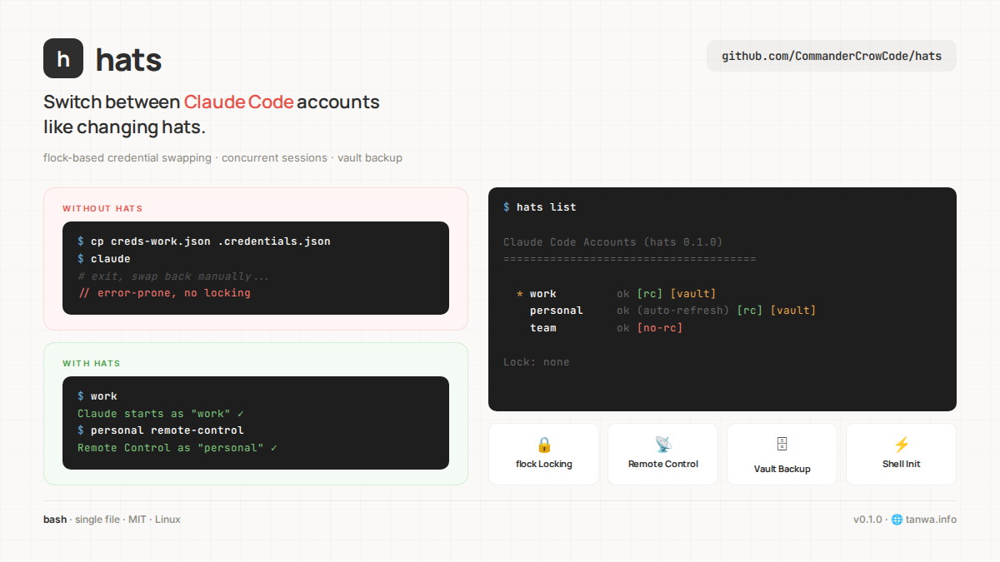

# hats



Switch between coding-tool accounts like changing hats.

Run multiple Claude Code and Codex accounts on the same machine — including concurrently — with per-account home/config isolation and flexible resource sharing.

## Why

Claude Code stores credentials at `~/.claude/.credentials.json` — one file, one account. Codex stores local auth and runtime state under `~/.codex/`. If you have multiple subscriptions or workspaces, switching accounts means swapping a shared home/config root. Running concurrent sessions is even harder.

**hats** solves this by giving each account its own provider-specific root (`CLAUDE_CONFIG_DIR` for Claude, `CODEX_HOME` for Codex):
- Each account gets an isolated home/config directory with its own credentials
- Concurrent sessions are inherently safe — no file swapping, no locking, no races
- Shared resources are symlinked to a provider-specific `base/` template
- Any resource can be selectively isolated per account with `hats unlink`
- Shell functions let you type the account name as a command

## Quick Start

```bash
# Install
git clone https://github.com/CommanderCrowCode/hats.git
cd hats && ./install.sh

# Initialize (migrates existing ~/.claude/ if present)
hats init

# Create accounts (opens claude for /login authentication)
hats add work
hats add personal

# Set your default (bare `claude` runs as this account)
hats default work

# Use it
hats swap personal              # starts claude as "personal"
hats swap work -- --model opus  # pass flags to claude

# Or add shell functions to your .zshrc/.bashrc
eval "$(hats shell-init)"
personal                        # just type the account name
work --model opus               # with arguments

# Codex support
hats codex init
hats codex add work
hats codex swap work
eval "$(hats codex shell-init)"
codex_work
```

## Install

```bash
git clone https://github.com/CommanderCrowCode/hats.git
cd hats
./install.sh
```

This copies `hats` to `~/.local/bin/`. Make sure `~/.local/bin` is in your `PATH`.

### Requirements

- Linux or macOS (no platform-specific dependencies)
- `python3` (for token inspection)
- Claude Code installed (`claude` on PATH)
- Codex CLI installed (`codex` on PATH) for Codex accounts

## Providers

`hats` supports:

- `claude` — default provider for backward compatibility
- `codex` — uses isolated `CODEX_HOME` directories

Use `hats codex ...` to manage Codex accounts.

## How It Works

### Per-Account Config Directories

Each account gets its own complete `CLAUDE_CONFIG_DIR`:

```
~/.hats/
├── config.toml                      # default account, version
├── claude/
│   ├── base/                        # template (shared resources)
│   │   ├── settings.json
│   │   ├── hooks.json
│   │   ├── .mcp.json
│   │   ├── CLAUDE.md
│   │   ├── projects/
│   │   └── ...
│   ├── work/                        # CLAUDE_CONFIG_DIR for "work"
│   │   ├── .credentials.json        # isolated (own tokens)
│   │   ├── .claude.json             # isolated (own state)
│   │   ├── settings.json  →         ../base/settings.json
│   │   ├── CLAUDE.md      →         ../base/CLAUDE.md
│   │   └── ...            →         ../base/...
│   └── personal/                    # CLAUDE_CONFIG_DIR for "personal"
│       └── (same structure)

~/.claude → ~/.hats/claude/work/     # symlink to default account
```

Running an account is simply:
```bash
CLAUDE_CONFIG_DIR=~/.hats/claude/work claude "$@"
```

No credential swapping. No locking. No save-back. Claude Code reads and writes directly to the account's own directory.

### Codex Account Homes

Codex uses `CODEX_HOME`, so each account gets its own isolated Codex home:

```
~/.hats/
├── codex/
│   ├── base/
│   │   ├── config.toml              # shared by default
│   │   ├── plugins/
│   │   ├── skills/
│   │   ├── prompts/
│   │   └── rules/
│   ├── work/
│   │   ├── auth.json                # isolated
│   │   ├── history.jsonl            # isolated
│   │   ├── sessions/                # isolated
│   │   ├── cache/                   # isolated
│   │   ├── log/                     # isolated
│   │   ├── state_*.sqlite*          # isolated
│   │   └── config.toml      →       ../base/config.toml
│   └── personal/
│       └── (same structure)
```

Running a Codex account is simply:
```bash
CODEX_HOME=~/.hats/codex/work codex "$@"
```

### Resource Sharing

By default, shared vs isolated resources depend on the provider:
- **Claude always isolated**: `.credentials.json`, `.claude.json` (per-account tokens and identity)
- **Claude shared by default**: `settings.json`, `hooks.json`, `.mcp.json`, `CLAUDE.md`, `projects/`, etc.
- **Codex always isolated**: `auth.json`, `history.jsonl`, `sessions/`, `cache/`, `log/`, `shell_snapshots/`, `state_*.sqlite*`, `logs_*.sqlite*`, etc.
- **Codex shared by default**: `config.toml`, `plugins/`, `skills/`, `prompts/`, `rules/`

Selectively isolate any resource:
```bash
hats unlink personal CLAUDE.md    # personal gets its own CLAUDE.md
hats link personal CLAUDE.md      # re-share with base
hats status personal              # see what's linked vs isolated
```

### Concurrency

Concurrent sessions are inherently safe. Each account has its own directory — sessions never touch each other's files. Token refresh writes to the correct account's `.credentials.json` automatically.

### Token Lifecycle

| Component | Lifetime | Renewal |
|-----------|----------|---------|
| Access token | ~8 hours | Auto-refreshed by Claude Code |
| Refresh token | Months | Re-run `/login` when it expires |

## Commands

### Account Management

```bash
hats <provider> init
hats <provider> add <name>
hats <provider> remove <name>
hats <provider> rename <old> <new>
hats <provider> default [name]
hats <provider> list
```

### Session Management

```bash
hats <provider> swap <name> [-- provider-args...]
```

Runs the provider CLI with the account's isolated home/config root.

```bash
hats swap work                        # interactive session
hats swap work -- --model opus        # pass flags to claude
hats swap work -- -p "hello"          # print mode
```

### Resource Management

```bash
hats <provider> link <acct> <file>
hats <provider> unlink <acct> <file>
hats <provider> status [account]
```

### Shell Integration

```bash
# Claude functions:
eval "$(hats shell-init)"

# Codex functions:
eval "$(hats codex shell-init)"

# With auto-skip permissions:
eval "$(hats shell-init --skip-permissions)"
```

This generates a function for each account. Claude keeps bare account names. Codex defaults to a `codex_` prefix to avoid name collisions:
```bash
work() { CLAUDE_CONFIG_DIR="$HOME/.hats/claude/work" claude "$@"; }
personal() { CLAUDE_CONFIG_DIR="$HOME/.hats/claude/personal" claude "$@"; }
codex_work() { CODEX_HOME="$HOME/.hats/codex/work" codex -c 'cli_auth_credentials_store="file"' "$@"; }
```

### Maintenance

```bash
hats fix               # Repair broken symlinks, verify auth, dedupe base/settings.json hooks
hats doctor            # Read-only health check (tooling, layout, symlinks, permissions)
hats completion bash   # Emit bash completion script; eval "$(...)" in .bashrc
hats completion zsh    # Emit zsh completion script; eval "$(...)" in .zshrc
hats providers         # List supported providers and show the default
hats audit             # Read the hats audit log (opt-in, see below)
hats version           # Show version
```

**`hats audit`** reads an opt-in JSONL audit log of account-mutating
operations (add / remove / rename / default / swap / link / unlink). Read-only
commands are deliberately NOT logged so the signal stays useful on shared
machines. Enable with `export HATS_AUDIT=1`; override the path with
`HATS_AUDIT_LOG=/path/to/audit.log` if `$HATS_DIR/audit.log` isn't where you
want it. `hats audit -n 20` shows the last 20 entries pretty-printed;
`hats audit --raw` emits JSONL for piping into `jq` / log shippers.

Global flag: `--no-color` (or `NO_COLOR` / `HATS_NO_COLOR` env var) disables
ANSI color output for any `hats` invocation.

**`hats doctor`** is a read-only companion to `hats fix` — it verifies layout
integrity without changing anything, then exits non-zero on hard issues. See
[`docs/doctor-checks.md`](docs/doctor-checks.md) for the full check catalog and
remediation guide. Works for both providers: `hats doctor` (claude) and
`hats codex doctor`.

**`install.sh --check`** runs the smoke-test suite (`tests/smoke.sh`) before
installing, aborting if any test fails — handy for CI/CD or anyone who wants
a gate on source changes.

**Tab completion** covers subcommand names, provider names, and account names
(dynamically read from `~/.hats/<provider>/` at completion time, so new
accounts are immediately completable without re-sourcing).

## Adding a New Account

```bash
hats add myaccount
# Claude Code opens — run /login, authenticate, then /exit
```

That's it. The account directory is created with symlinks to base, and `/login` stores credentials in the isolated directory.

For Codex:

```bash
hats codex add myaccount
hats codex add headless --api-key
hats codex add remote --device-auth
```

`hats codex add` now lets you choose the Codex auth path per account:

- ChatGPT login: browser-based local sign-in
- API key: reads `OPENAI_API_KEY` and runs `codex login --with-api-key`
- Device auth: runs `codex login --device-auth` for headless/browserless setups

All three modes still use the account's isolated `CODEX_HOME`.

## Codex Authentication Notes

Codex support assumes file-based credentials stored under each account's `CODEX_HOME`.

`hats codex init` creates a shared `config.toml` with:

```toml
cli_auth_credentials_store = "file"
```

When you run `hats codex add <name>` without a Codex auth flag in an interactive terminal, hats prompts you to choose:

- `ChatGPT login` for local browser sign-in
- `API key` for `OPENAI_API_KEY`-driven login
- `Device auth` for headless machines

For non-interactive environments, use one of these explicitly:

```bash
OPENAI_API_KEY=... hats codex add ci --api-key
hats codex add remote --device-auth
```

If you override Codex to use `keyring` or `auto`, hats can no longer guarantee that account credentials stay isolated inside each account directory.

## Remote Control

Claude Code's [Remote Control](https://docs.anthropic.com/en/docs/claude-code/remote-control) feature requires the `user:sessions:claude_code` OAuth scope, which is only granted by the full `/login` flow.

`hats list` shows `[rc]` for accounts with Remote Control support and `[no-rc]` for those without.

## Status Output

```
$ hats list
hats v1.1.0 — Claude Code Accounts
=======================================

  * work         ok (expires 2026-03-07 14:30) [rc]
    personal     ok (access expired, will auto-refresh) [rc]
    team         ok (expires 2026-03-06 22:15) [no-rc]

  3 account(s)
```

- `*` marks the default account
- `[rc]` = Remote Control supported
- Access tokens expire every ~8 hours but auto-refresh via the refresh token

## Configuration

| Variable | Default | Purpose |
|----------|---------|---------|
| `HATS_DIR` | `~/.hats` | Hats root directory |
| `NO_COLOR` | unset | Any non-empty value disables ANSI color (see [no-color.org](https://no-color.org)) |
| `HATS_NO_COLOR` | `0` | Same as `NO_COLOR`, hats-scoped alias |
| `HATS_AUDIT` | `0` | Set to `1` to enable the audit log (off by default) |
| `HATS_AUDIT_LOG` | `$HATS_DIR/audit.log` | Override the audit-log path |

### File Layout

```
~/.hats/
├── config.toml                       # Global config (default account)
├── claude/
│   ├── base/                         # Template (never run directly)
│   │   ├── settings.json             # Shared settings
│   │   ├── CLAUDE.md                 # Shared instructions
│   │   ├── projects/                 # Shared project data
│   │   └── ...
│   ├── <account>/                    # Per-account config directory
│   │   ├── .credentials.json         # Isolated credentials
│   │   ├── .claude.json              # Isolated state
│   │   └── (everything else)  →      ../base/...
├── codex/
│   ├── base/                         # Shared Codex resources
│   │   ├── config.toml
│   │   ├── plugins/
│   │   ├── skills/
│   │   ├── prompts/
│   │   └── rules/
│   ├── <account>/                    # Per-account CODEX_HOME
│   │   ├── auth.json                 # Isolated credentials
│   │   ├── history.jsonl             # Isolated history
│   │   ├── sessions/                 # Isolated runtime state
│   │   └── config.toml       →       ../base/config.toml

~/.claude → ~/.hats/claude/<default>/ # Symlink so bare `claude` works
```

## Migrating from v0.2.x

`hats init` automatically detects and migrates v0.2.x setups:

1. Moves `~/.claude/` contents to `~/.hats/claude/base/`
2. Creates per-account directories from existing `.credentials.<name>.json` files
3. Symlinks `~/.claude` to the default account
4. Preserves external symlinks (CLAUDE.md, agents, skills)

## Troubleshooting

**Auth errors after idle:**
The refresh token may have expired. Run `/login` inside a session for that account.

**Wrong identity showing:**
Each account has its own `.claude.json` state. Run `hats fix` to verify symlinks, or start a fresh session.

**Broken symlinks after Claude Code update:**
Run `hats fix` — it detects broken symlinks and repairs them, and adds symlinks for new resources added to base.

## License

MIT
